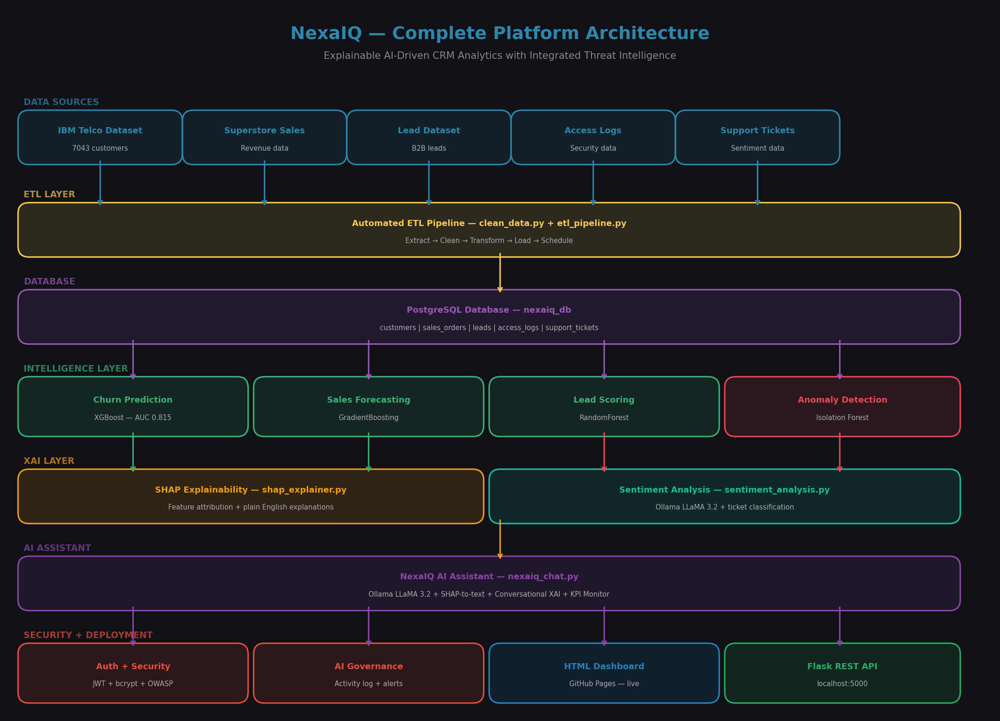

# NexaIQ — Explainable AI-Driven CRM Analytics with Integrated Threat Intelligence


## Live Dashboard
View live: https://gourikrishna1311.github.io/NexaIQ

## Overview
NexaIQ is an end-to-end CRM analytics and business intelligence
platform bridging Data Science and Information Security. It combines
explainable AI-powered predictive analytics, anomaly-based threat
detection, and a conversational AI layer into one unified system.

Built as a pre-MTech research project addressing four documented
gaps in current CRM-AI literature.

## Architecture


## Literature Gaps Addressed
1. Black-box ML — SHAP explainability on every prediction
2. No AI governance — Activity logging and suspicious query detection
3. Data fragmentation — Single ETL pipeline across all sources
4. No conversational XAI — Plain English model explanations via LLaMA

## ML Model Results
| Model | Accuracy | AUC Score |
|-------|----------|-----------|
| Logistic Regression | 73.17% | 0.8114 |
| Random Forest | 75.23% | 0.8095 |
| XGBoost (Best) | 75.23% | 0.8150 |

## Key Business Insights
- 26.54% overall churn rate — 1 in 4 customers leaving
- Month-to-month customers churn at 42.71%
- First 6 months most critical — 53.3% churn rate
- $139,131 monthly revenue lost from churned customers
- 521 high risk customers identified for retention campaigns

## Tech Stack
| Layer | Technologies |
|-------|-------------|
| Language | Python 3.13, SQL |
| Database | PostgreSQL 17 |
| ML Models | XGBoost, Random Forest, Gradient Boosting |
| Explainability | SHAP |
| Anomaly Detection | Isolation Forest |
| AI Assistant | Ollama LLaMA 3.2 (local, free) |
| Security | JWT, bcrypt, OWASP, AES encryption |
| Dashboard | HTML5, Chart.js — GitHub Pages |
| API | Flask REST API |
| Version Control | Git, GitHub |

## Project Structure

NexaIQ/

├── data/

│   ├── raw/                   — Original datasets

│   └── processed/             — Cleaned data + SHAP values

├── scripts/

│   ├── clean_data.py          — ETL cleaning pipeline

│   ├── etl_pipeline.py        — Automated scheduling

│   ├── churn_model.py         — ML model training

│   ├── shap_explainer.py      — XAI explainability

│   ├── shap_dashboard.py      — SHAP visualizations

│   ├── anomaly_detector.py    — Dual anomaly detection

│   ├── ai_assistant.py        — AI business assistant

│   ├── nexaiq_chat.py         — Interactive AI chat

│   ├── sentiment_analysis.py  — Customer sentiment

│   ├── kpi_monitor.py         — Live KPI monitoring

│   ├── auth_system.py         — JWT authentication

│   ├── security_hardening.py  — OWASP compliance

│   ├── ai_governance.py       — AI activity logging

│   ├── build_dashboard.py     — HTML dashboard builder

│   └── create_architecture.py — Architecture diagram

├── models/                    — Saved ML models (.pkl)

├── outputs/                   — Charts, reports, dashboard

├── app.py                     — Flask REST API

├── index.html                 — Live dashboard (GitHub Pages)

└── README.md

## API Endpoints (Local)
GET  http://localhost:5000/              — Platform info

GET  http://localhost:5000/api/health   — Health check

GET  http://localhost:5000/api/kpis     — Live KPIs

GET  http://localhost:5000/api/high-risk — High risk customers

GET  http://localhost:5000/api/churn-by-contract — Contract analysis

GET  http://localhost:5000/api/churn-by-tenure   — Tenure analysis

POST http://localhost:5000/api/predict  — Churn prediction

GET  http://localhost:5000/api/dashboard — HTML dashboard

GET  http://localhost:5000/api/summary  — Project summary

## Security Features
- JWT authentication with role-based access control
- bcrypt password hashing
- SQL injection prevention with pattern detection
- AES data encryption at rest
- OWASP Top 10 compliance — 83% score
- AI agent activity logging and governance module

## How to Run Locally
```bash
# Clone the repository
git clone https://github.com/Gourikrishna1311/NexaIQ

# Create virtual environment
python -m venv venv
venv\Scripts\Activate.ps1

# Install dependencies
pip install -r requirements.txt

# Run ETL pipeline
python scripts/etl_pipeline.py

# Build dashboard
python scripts/build_dashboard.py

# Start API server
python app.py

# Open dashboard
start outputs/nexaiq_dashboard.html
```

## Research Paper
Read the full paper: [NexaIQ Research Paper](research_paper.md)

## Author
Gourikrishna — BTech CSE Graduate
Pre-MTech Project — Data Science and Information Security
Built over 30 days — June 2026

## Status
Complete — 30 days of consistent development
